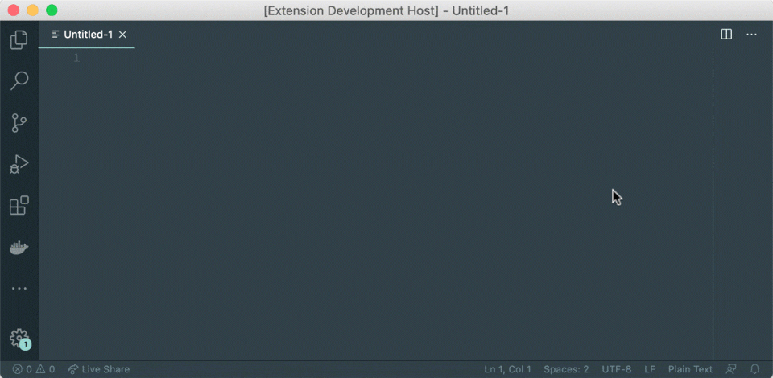
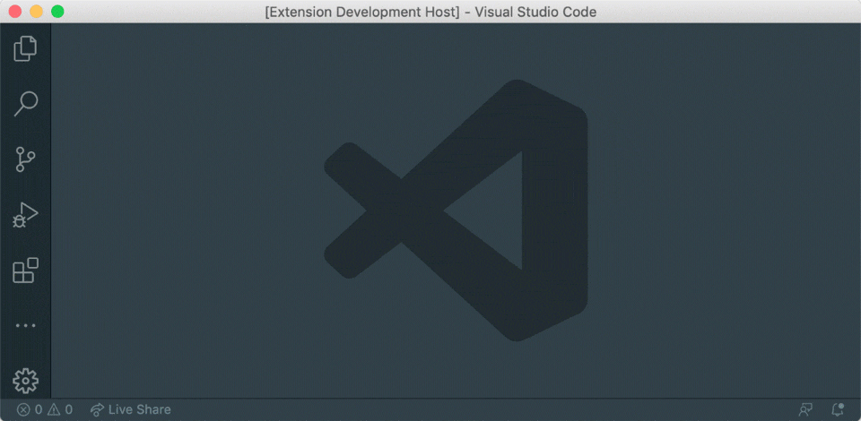

  
  <h1>ngrok for vscode</h1>
  
<em>A VSCode extension for controlling <a href="https://ngrok.com/">ngrok</a> from the command palette.</em>

## Features

- `ngrok: start`: Start an HTTP tunnel pointing to a port of your choice from the command palette

  

- `ngrok: start`: Start a named HTTP tunnel from your ngrok config

  

- `ngrok: stop`: Stop one or all HTTP tunnels

  

- `ngrok: dashboard`: Open the ngrok dashboard

## Extension Settings

This extension contributes the following settings:

- `ngrokForVSCode.configPath`: set a custom path to your ngrok config

## Release Notes

### [1.2.0](https://github.com/philnash/ngrok-for-vscode/compare/v1.1.0...v1.2.0)

#### Added

- On first activation extension downloads the correct ngrok binary for your system

### 1.1.0

#### Added

- Buttons to copy tunnel URL to clipboard or open in browser in success message

### 1.0.1

#### Fixed

- When the default ngrok config is not present, don't show an error
- When the config file is not present, don't try to use it as part of the connect options

### 1.0.0

Initial release of _ngrok for VSCode_.

- Supports starting and stopping ngrok tunnels and opening the ngrok dashboard

## Thanks

Thanks go to [Alan Shreve](https://github.com/inconshreveable) for [ngrok](https://ngrok.com) and [Alex Bubenshchykov](https://github.com/bubenshchykov) for the [Node.js wrapper for ngrok](https://github.com/bubenshchykov/ngrok).
